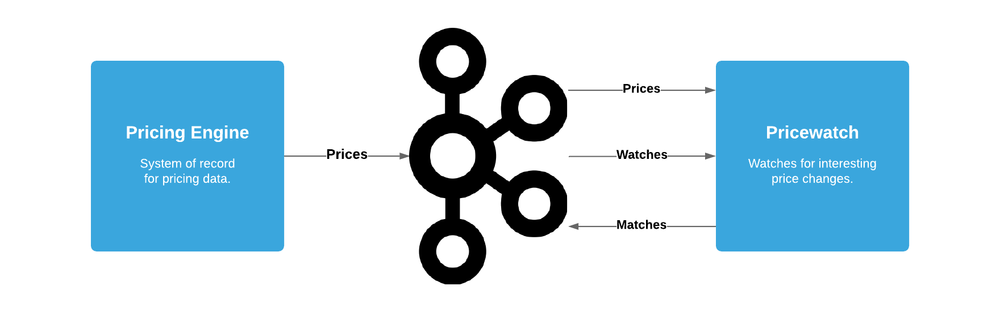

# pricewatch

Reaction Pricewatch is a demo project to monitor changes in product prices.

Read more at the announcement [blog post](https://blog.reactioncommerce.com/pricewatch/).

## Description



### Registering Price Watches
One of the first inputs to the system is registering when a user would like to
track a price. We create a "watch" record in Pricewatch to track a subscription
for the user. The watch contains some information about the user (userId and
email), about the product (product id) and the current price at the time the
watch is created.

Watches could be created from a user interface or from less direct triggers
such as cart activity. For now though, there's no interface so watches are
created manually. Any Kafka producer will work. The Kafka CLI tools, Kafkacat
or a GUI like Conduktor are good options.

Here's an example using the Kafka CLI tools, configured for use with Reaction's
[docker-confluent-platform](https://github.com/reactioncommerce/docker-confluent-platform/).

```sh
docker run --rm -it \ --network streams.reaction.localhost \
  confluentinc/cp-enterprise-kafka:5.3.1 \
  kafka-console-producer \
    --broker-list=kafka.streams.reaction.localhost:9092 \
    --topic=reaction.pricewatch.watches.json-gen1 \
    --property "parse.key=true" \
    --property "key.separator=|"
```

The command will open an interactive prompt. Paste a message, like the one
below, to produce a new watch.

```
sku1:user1|{"id":"sku1:user1","user-id":"user1","email":"user1@reactioncommerce.com","product-id":"sku1","start-price":100.00}
```

Watches are stored as a compacted topic in Kafka, so we can treat this much like
a database table. Kafka will always keep at least the latest version of each
watch key in the topic. Records can be deleted by publishing a null value for
the key.

### Finding Matches on Price Changes
Pricewatch consumes price changes from Kafka and then detects if those changes
are significant enough to notify interested users. We call this a "match".

When a match is made, Pricewatch produces match data to an output Kafka topic.
These output match messages be used to power actions such as emailing or
texting users.

The matches topic is not compacted. We treat it like a stream of flowing data.

## Example Messages

### Watch

#### Key

`product-id:user-id`

Example: `sku1:user1`

#### Message

```json
{
  "id" : "sku1:user1",
  "user-id" : "user1",
  "email" : "user1@reactioncommerce.com",
  "product-id" : "sku1",
  "start-price" : 200.0
}
```

### Match

#### Key

`product-id:user-id`

Example: `sku1:user1`

#### Message

```json
{
  "pricewatch": {
    "id" : "sku1:user1",
    "user-id" : "user1",
    "email" : "user1@reactioncommerce.com",
    "product-id" : "sku1",
    "start-price" : 200.0
    },
  "pricing": {
    "min": 100.0
  }
}
```

### Prices

The Pricing Engine produces messages in Avro format. The schema for the
messages in the `prices-by-id` topic is stored in JSON format in
[prices-by-id.json](./resources/reaction/pricewatch/avro/price-by-id.json).


## Developing

### Setup

- Run `./bin/setup`
- Edit `.env` and customize if necessary

### The REPL Environment

To begin developing, start with a REPL.

```sh
docker-compose run --rm --service-ports web bin/dev
```

Then load the development namespace.

```clojure
user=> (dev)
:loaded
```

Run `go` to prep and initiate the system.

```clojure
dev=> (go)
:initiated
```

### Reloading Code in the REPL

When you make changes to your source files, use `reset` to reload any
modified files and reset the server. The code will be reloaded and the system
will be restarted.

```clojure
dev=> (reset)
:reloading (...)
:resumed
```

### Safely Stopping the REPL

It's best to explicitly stop the system before stopping the REPL else, it can
hang.

```clojure
dev=> (halt)
dev=> :repl/quit
```

If you quit and the process does hang then you can kill it with Docker in
another shell.

```sh
docker-compose kill web
```

### Testing

Testing is fastest through the REPL, as you avoid environment startup time.

```clojure
dev=> (test :unit)
...
```

But you can also run tests through a standalone command:

```sh
docker-compose run --rm web bin/test --watch
```

## License

© 2020 Reaction Commerce

Licensed under the Apache License, Version 2.0 (the "License"); you may not use
this file except in compliance with the License. You may obtain a copy of the
License at

http://www.apache.org/licenses/LICENSE-2.0

Unless required by applicable law or agreed to in writing, software distributed
under the License is distributed on an "AS IS" BASIS, WITHOUT WARRANTIES OR
CONDITIONS OF ANY KIND, either express or implied. See the License for the
specific language governing permissions and limitations under the License.
